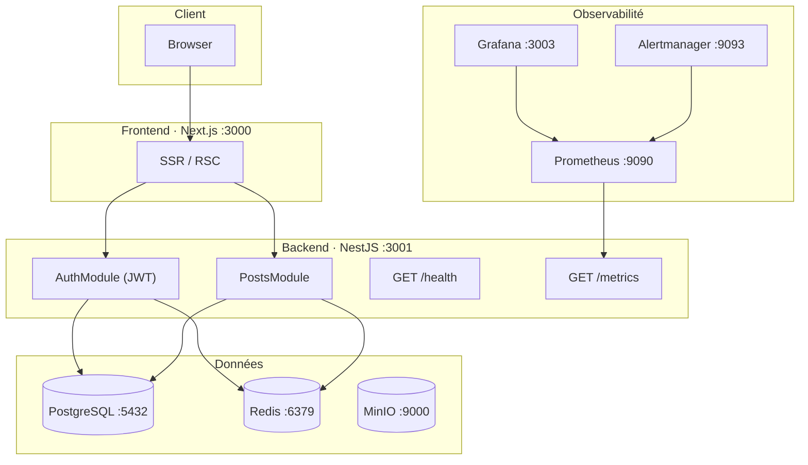

# ynov-blog - Blog CMS Headless

[](https://github.com/alexis-feron/ynov-cicd-projet/actions/workflows/ci.yml)
[](https://github.com/alexis-feron/ynov-cicd-projet/actions/workflows/cd.yml)

Blog CMS headless construit avec NestJS, Next.js et PostgreSQL.  
Conçu autour de la Clean Architecture, entièrement conteneurisé, avec CI/CD automatisé.

## Architecture



## Démarrage rapide

**Prérequis :** Docker 24+, Docker Compose v2, Node.js 20+

```bash
git clone https://github.com/alexis-feron/ynov-cicd-projet
cd ynov-cicd-projet
cp .env.example .env
docker compose up -d
```

Le backend génère les migrations automatiquement au premier démarrage.

## Services disponibles

| Service       | URL locale                    | Identifiants par défaut |
| ------------- | ----------------------------- | ----------------------- |
| Frontend      | http://localhost:3000         | -                       |
| Backend API   | http://localhost:3001         | -                       |
| API Health    | http://localhost:3001/health  | -                       |
| API Metrics   | http://localhost:3001/metrics | -                       |
| MinIO Console | http://localhost:9001         | minioadmin / minioadmin |
| Prometheus    | http://localhost:9090         | -                       |
| Grafana       | http://localhost:3003         | admin / admin           |
| Alertmanager  | http://localhost:9093         | -                       |

## Commandes

### Backend

```bash
cd backend
npm run start:dev        # hot-reload
npm test                 # tests unitaires
npm run test:coverage    # tests + rapport couverture
npm run test:integration # tests d'intégration (Docker requis)
npm run lint
npm run db:migrate:dev   # nouvelle migration
npm run db:studio        # Prisma Studio
```

### Frontend

```bash
cd frontend
npm run dev
npm test
npm run test:e2e         # Playwright (stack démarrée)
npm run build
```

### Infrastructure

```bash
# Démarrage local complet
docker compose up -d

# Build images production
docker compose -f docker-compose.prod.yml build

# Validation Dockerfiles et compose
./docker/test-build.sh

# Terraform (staging cloud)
cd infra/terraform
terraform init && terraform plan

# Ansible - provisionner un serveur
ansible-playbook -i infra/ansible/inventory.ini \
  infra/ansible/playbooks/setup.yml --limit staging

# Ansible - déployer
ansible-playbook -i infra/ansible/inventory.ini \
  infra/ansible/playbooks/deploy.yml --limit staging

# Valider les workflows CI/CD
./.github/scripts/validate-workflows.sh

# Valider l'IaC
./infra/scripts/validate-infra.sh
```

## Structure du projet

```
ynov-cicd-projet/
├── backend/                    # NestJS - Clean Architecture
│   ├── src/
│   │   ├── modules/
│   │   │   ├── auth/           # JWT + Passport
│   │   │   ├── posts/          # CRUD articles
│   │   │   ├── users/          # Gestion utilisateurs
│   │   │   ├── health/         # GET /health
│   │   │   └── metrics/        # GET /metrics (Prometheus)
│   │   ├── common/             # Guards, decorators, interceptors
│   │   ├── prisma/             # Singleton PrismaService
│   │   └── redis/              # Wrapper ioredis
│   ├── prisma/schema.prisma
│   └── test/                   # Tests d'intégration
│
├── frontend/                   # Next.js SSR
│   └── tests/e2e/              # Playwright
│
├── infra/
│   ├── terraform/              # IaC cloud (Hetzner)
│   ├── ansible/                # Configuration serveur + déploiement
│   │   ├── playbooks/
│   │   └── roles/ (base, docker, app)
│   ├── monitoring/             # Prometheus, Alertmanager, Grafana
│   └── local/                  # Serveur SSH cible pour tests Ansible
│
├── .github/
│   ├── workflows/
│   │   ├── ci.yml              # Lint, tests, coverage, sécurité
│   │   ├── cd.yml              # Build → push GHCR → deploy staging
│   │   └── rollback.yml        # Rollback manuel
│   └── scripts/
│       └── validate-workflows.sh
│
├── docker/
│   └── test-build.sh
├── docker-compose.yml          # Stack locale de développement
├── docker-compose.prod.yml     # Stack production
└── docs/                       # Documentation technique détaillée
```

## Documentation

| Document                                                     | Contenu                                        |
| ------------------------------------------------------------ | ---------------------------------------------- |
| [docs/architecture.md](docs/architecture.md)                 | Schéma global, flux de données, justifications |
| [docs/backend-architecture.md](docs/backend-architecture.md) | Clean Architecture, design patterns            |
| [docs/design-patterns.md](docs/design-patterns.md)           | Catalogue des patterns avec exemples           |
| [docs/database-schema.md](docs/database-schema.md)           | ERD, relations, index                          |
| [docs/auth.md](docs/auth.md)                                 | JWT, refresh tokens, RBAC                      |
| [docs/testing-strategy.md](docs/testing-strategy.md)         | Pyramide de tests, stratégie de mocking        |
| [docs/contributing.md](docs/contributing.md)                 | Conventions de contribution                    |

## Variables d'environnement

Copier `.env.example` en `.env` et ajuster les valeurs.

Les variables sensibles en production (`JWT_SECRET`, mots de passe) doivent être
définies dans les secrets GitHub (CD pipeline) ou chiffrées avec `ansible-vault`.

## Licence

MIT
