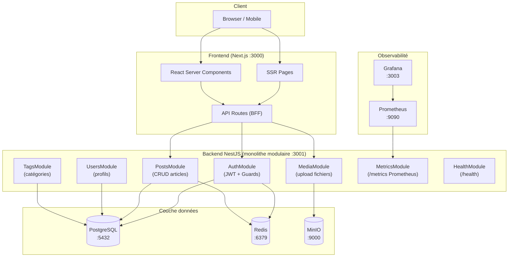

# Architecture globale - Blog CMS Headless

## Schéma d'architecture



## Découpage backend (Clean Architecture)

Chaque module NestJS suit la même structure en couches :

```
backend/src/
├── common/                    # Partagé entre modules
│   ├── decorators/
│   ├── filters/               # Exception filters
│   ├── guards/
│   ├── interceptors/          # Logging, transform response
│   └── pipes/                 # Validation
│
├── modules/
│   ├── auth/
│   │   ├── auth.controller.ts
│   │   ├── auth.service.ts
│   │   ├── auth.module.ts
│   │   ├── strategies/        # JWT, Local (Passport)
│   │   └── dto/
│   │
│   ├── users/
│   │   ├── users.controller.ts
│   │   ├── users.service.ts
│   │   ├── users.repository.ts   # Abstraction Prisma
│   │   ├── users.module.ts
│   │   └── dto/
│   │
│   ├── posts/
│   │   ├── posts.controller.ts
│   │   ├── posts.service.ts
│   │   ├── posts.repository.ts
│   │   ├── posts.module.ts
│   │   └── dto/
│   │
│   ├── tags/
│   ├── media/
│   ├── health/
│   └── metrics/
│
├── prisma/                    # PrismaService (singleton)
├── redis/                     # RedisService (wrapper ioredis)
├── app.module.ts
└── main.ts
```

**Règles par couche :**

- **Controller** - routing + validation HTTP uniquement
- **Service** - logique métier pure, testable sans HTTP
- **Repository** - isole Prisma, mockable en tests unitaires

## Flux de données

### Lecture d'un article (public)

```
Browser
  → GET /blog/[slug] (Next.js SSR)
    → fetch("backend:3001/posts/slug/:slug")
      → PostsController.findBySlug()
        → PostsService.findBySlug()
          → Redis.get("post:slug")      ← HIT → retourne directement
          → [MISS] PostsRepository.findBySlug()
            → PostgreSQL SELECT
          → Redis.set("post:slug", data, TTL=300s)
        ← Post entity
      ← JSON response
    ← HTML rendu côté serveur (SSR)
  ← Page HTML au browser
```

### Création d'un article (auteur authentifié)

```
Browser
  → POST /api/posts (Next.js API Route)
    → forward + Authorization: Bearer <token>
      → PostsController.create()  [JwtGuard → RolesGuard]
        → PostsService.create()
          → PostsRepository.create()
            → PostgreSQL INSERT
          → Redis.del("posts:list:*")   ← invalidation cache
        ← Post entity
      ← 201 Created + JSON
    ← 201
  ← Redirect vers l'article
```

### Upload d'image

```
Browser
  → POST /api/media (multipart/form-data)
    → MediaController.upload()  [JwtGuard]
      → MediaService.upload()
        → MinIO.putObject(bucket, filename, stream)
        → PostgreSQL INSERT (url, metadata)
      ← { url: "http://minio:9000/blog/image.jpg" }
```

## Organisation du repo

**Monorepo sans outil de workspace** (pas de Turborepo/Nx)

```
ynov-cicd-projet/
├── backend/               # NestJS app autonome
├── frontend/              # Next.js app autonome
├── infra/
│   ├── terraform/         # IaC (VMs, réseau)
│   ├── ansible/           # Configuration serveurs
│   └── monitoring/        # Prometheus + Grafana
├── docs/                  # Documentation
├── .github/workflows/     # CI/CD
├── docker-compose.yml     # Orchestration locale
└── .env.example
```

**Pourquoi pas Turborepo/Nx ?**

- Complexité non justifiée pour 2 apps
- Chaque app reste déployable indépendamment
- Pipelines CI plus simples
- Contexte pédagogique

## Justifications des choix

| Choix                          | Justification                                                                                                                       |
| ------------------------------ | ----------------------------------------------------------------------------------------------------------------------------------- |
| **NestJS monolithe modulaire** | Évite la complexité microservices prématurée. Modules découplés, déployés ensemble. Scalable horizontalement via load balancer.     |
| **Prisma** (pas TypeORM)       | Type-safety native, migrations versionnées, meilleure DX. TypeORM est plus verbeux et ses types inférés moins fiables.              |
| **Repository pattern**         | Isole l'ORM du service. `PostsService` ne connaît pas Prisma, il appelle `PostsRepository`. Mockable proprement en tests unitaires. |
| **Redis comme cache**          | Articles en lecture >> écriture. Cache TTL court (5 min) réduit la charge PostgreSQL.                                               |
| **MinIO** (pas S3 direct)      | Compatibilité API S3, auto-hébergeable, gratuit. Bascule vers S3 en changeant uniquement les variables d'env.                       |
| **Next.js SSR**                | SEO critique pour un blog. Les articles doivent être indexables. SSR garantit le contenu dans le HTML initial.                      |
| **JWT stateless**              | Simplifie l'architecture. Tokens de refresh en Redis pour pouvoir les révoquer.                                                     |
| **Prometheus + Grafana**       | Standard industrie. NestJS expose `/metrics`. Grafana lit les métriques sans modifier l'app.                                        |

## Contrat d'interface Backend → Frontend

```typescript
// Réponse paginée standard
{
  data: T[],
  meta: {
    page: number,
    limit: number,
    total: number,
    totalPages: number
  }
}

// Erreur standard
{
  statusCode: number,
  message: string | string[],
  error: string
}
```

## Ports des services

| Service       | Port | Rôle                  |
| ------------- | ---- | --------------------- |
| NestJS        | 3001 | API REST + `/metrics` |
| Next.js       | 3000 | Frontend SSR          |
| PostgreSQL    | 5432 | Base principale       |
| Redis         | 6379 | Cache + sessions      |
| MinIO API     | 9000 | Stockage fichiers     |
| MinIO Console | 9001 | Interface admin       |
| Prometheus    | 9090 | Collecte métriques    |
| Grafana       | 3003 | Dashboard monitoring  |
